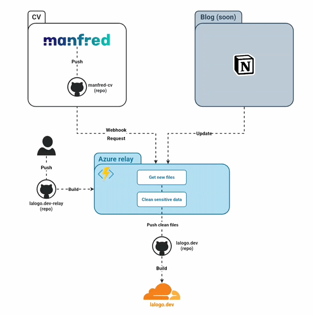

# Lalogo.dev relay
This repository contains the code for the management of the webhooks and cron jobs for [my personal website](https://lalogo.dev) that clean the sensitive data.



## .env file example
```env
GITHUB_TOKEN=your_github_token
OWNER=la-lo-go
AUTHOR_EMAIL=your@email.com
MANFRED_REPO=manfred-cv
MAIN_REPO=lalogo.dev
NEW_MANFRED_DATA_PATH=src/data/manfred
```

## Webhooks local development
1. Start a new [smee.io](https://smee.io) tunnel
2. Add the smee.io tunnel to the GitHub webhook
3. Run the following command to forward the port 7071 to the smee.io tunnel
    ```bash
    smee -u https://smee.io/[code] -p 7071 -P /api/Push-Manfred-CV
    ```
## Run the Azure functions locally
- Fresh start (install, compile and run)
     ```bash
     npm start
     ```
- Run last compiled version
     ```bash
     func start
     ```


## License
[Mozilla Public License 2.0](https://www.mozilla.org/en-US/MPL/2.0/)

[](https://www.mozilla.org/en-US/MPL/2.0/)